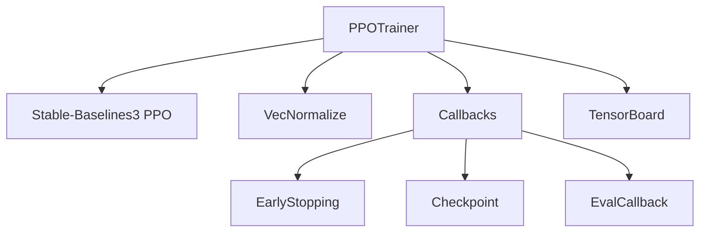

# Agents

Les agents implémentent les stratégies de décision, qu'elles soient basées sur l'apprentissage par renforcement ou sur des règles classiques.

## 🤖 PPO Trainer

Classe principale pour l'entraînement avec PPO.

### Architecture



### Implémentation

```python
class PPOTrainer:
    def __init__(self, config: PDPConfig, **kwargs):
        self.config = config
        self.learning_rate = kwargs.get('learning_rate', 3e-4)
        self.n_steps = kwargs.get('n_steps', 2048)
        self.batch_size = kwargs.get('batch_size', 64)
        self.n_epochs = kwargs.get('n_epochs', 10)
        self.gamma = kwargs.get('gamma', 0.99)
        
        self.model = None
        self.env = None
        self.vec_env = None
    
    def setup_environment(self):
        """Configure l'environnement vectorisé"""
        def make_env():
            return EnvironmentRegistry.create('strategic', self.config)
        
        self.env = make_env()
        self.vec_env = DummyVecEnv([make_env])
        self.vec_env = VecNormalize(
            self.vec_env,
            norm_obs=True,
            norm_reward=False,
            clip_obs=10.0
        )
    
    def setup_model(self):
        """Initialise le modèle PPO"""
        self.model = PPO(
            policy='MultiInputPolicy',
            env=self.vec_env,
            learning_rate=self.learning_rate,
            n_steps=self.n_steps,
            batch_size=self.batch_size,
            n_epochs=self.n_epochs,
            gamma=self.gamma,
            verbose=1,
            tensorboard_log='./logs/tensorboard'
        )
    
    def train(self, total_timesteps: int, callbacks=None):
        """Lance l'entraînement"""
        self.setup_environment()
        self.setup_model()
        
        self.model.learn(
            total_timesteps=total_timesteps,
            callback=callbacks
        )
        
        return self.model
    
    def evaluate(self, n_episodes: int = 10) -> dict:
        """Évalue le modèle"""
        results = {
            'rewards': [],
            'costs': [],
            'service_levels': []
        }
        
        for _ in range(n_episodes):
            obs = self.vec_env.reset()
            done = False
            total_reward = 0
            
            while not done:
                action, _ = self.model.predict(obs, deterministic=True)
                obs, reward, done, info = self.vec_env.step(action)
                total_reward += reward[0]
            
            results['rewards'].append(total_reward)
            # ... autres métriques
        
        return results
    
    def save(self, path: str):
        """Sauvegarde le modèle"""
        self.model.save(f"{path}/model.zip")
        self.vec_env.save(f"{path}/vec_normalize.pkl")
    
    def load(self, path: str):
        """Charge un modèle"""
        self.setup_environment()
        self.vec_env = VecNormalize.load(
            f"{path}/vec_normalize.pkl", 
            self.vec_env
        )
        self.model = PPO.load(f"{path}/model.zip", env=self.vec_env)
```

## 📋 Stratégies Baseline

Implémentations des stratégies classiques de production.

### Classe de Base

```python
class BaseStrategy(ABC):
    def __init__(self, env):
        self.env = env
        self.config = env.config
    
    @abstractmethod
    def get_action(self, observation: dict) -> np.ndarray:
        """Retourne l'action à effectuer"""
        pass
    
    def run_episode(self) -> Tuple[float, dict]:
        """Exécute un épisode complet"""
        obs, _ = self.env.reset()
        done = False
        total_reward = 0
        metrics = []
        
        while not done:
            action = self.get_action(obs)
            obs, reward, done, _, info = self.env.step(action)
            total_reward += reward
            metrics.append(info)
        
        return total_reward, {'metrics': metrics}
```

### Lot-for-Lot

Production exactement égale à la demande nette.

```python
class LotForLotStrategy(BaseStrategy):
    def get_action(self, observation: dict) -> np.ndarray:
        demand = observation['current_demand'][0]
        stock = observation['stocks'][0]
        
        # Demande nette
        net_demand = max(0, demand - stock)
        
        # Production régulière d'abord
        regular_cap = self.config.regular_capacity[0]
        regular = min(net_demand, regular_cap)
        remaining = net_demand - regular
        
        # Overtime si nécessaire
        overtime_cap = self.config.overtime_capacity[0]
        overtime = min(remaining, overtime_cap)
        remaining -= overtime
        
        # Sous-traitance en dernier
        subcontracting = min(remaining, self.config.subcontracting_capacity[0])
        
        # Normaliser en [0, 1]
        return np.array([
            regular / regular_cap,
            overtime / overtime_cap if overtime_cap > 0 else 0,
            subcontracting / self.config.subcontracting_capacity[0]
        ])
```

### Chase Strategy

Suivre la demande en utilisant la capacité disponible.

```python
class ChaseStrategy(BaseStrategy):
    def get_action(self, observation: dict) -> np.ndarray:
        demand = observation['current_demand'][0]
        
        regular_cap = self.config.regular_capacity[0]
        overtime_cap = self.config.overtime_capacity[0]
        sub_cap = self.config.subcontracting_capacity[0]
        total_cap = regular_cap + overtime_cap + sub_cap
        
        # Ratio de la demande par rapport à la capacité totale
        ratio = min(1.0, demand / total_cap)
        
        return np.array([ratio, ratio, ratio])
```

### Level Strategy

Production constante sur l'horizon.

```python
class LevelStrategy(BaseStrategy):
    def __init__(self, env):
        super().__init__(env)
        # Calculer la production moyenne nécessaire
        total_demand = sum(self.config.demand_mean) * self.config.horizon
        self.level_production = total_demand / self.config.horizon
    
    def get_action(self, observation: dict) -> np.ndarray:
        regular_cap = self.config.regular_capacity[0]
        
        # Production constante
        regular = min(self.level_production, regular_cap)
        ratio = regular / regular_cap
        
        return np.array([ratio, 0.0, 0.0])
```

### EOQ Strategy

Quantité économique de commande.

```python
class EOQStrategy(BaseStrategy):
    def __init__(self, env):
        super().__init__(env)
        # Calculer EOQ
        D = self.config.demand_mean[0] * self.config.horizon
        S = self.config.setup_cost if hasattr(self.config, 'setup_cost') else 100
        H = self.config.holding_cost[0]
        
        self.eoq = np.sqrt(2 * D * S / H)
    
    def get_action(self, observation: dict) -> np.ndarray:
        stock = observation['stocks'][0]
        
        # Commander si stock < EOQ/2
        if stock < self.eoq / 2:
            regular_cap = self.config.regular_capacity[0]
            production = min(self.eoq, regular_cap)
            return np.array([production / regular_cap, 0.0, 0.0])
        
        return np.array([0.0, 0.0, 0.0])
```

## 📊 Comparaison des Stratégies

```python
BASELINE_STRATEGIES = {
    'lot_for_lot': LotForLotStrategy,
    'chase': ChaseStrategy,
    'level': LevelStrategy,
    'eoq': EOQStrategy,
}

def compare_strategies(config, n_episodes=10):
    """Compare toutes les stratégies"""
    results = {}
    
    for name, StrategyClass in BASELINE_STRATEGIES.items():
        env = EnvironmentRegistry.create('strategic', config)
        strategy = StrategyClass(env)
        
        rewards = []
        costs = []
        
        for _ in range(n_episodes):
            reward, info = strategy.run_episode()
            rewards.append(reward)
            total_cost = sum(
                m['costs']['production_cost'] + 
                m['costs']['inventory_cost'] + 
                m['costs']['shortage_cost']
                for m in info['metrics']
            )
            costs.append(total_cost)
        
        results[name] = {
            'mean_reward': np.mean(rewards),
            'std_reward': np.std(rewards),
            'mean_cost': np.mean(costs),
        }
    
    return results
```

## 🧪 Tests

```python
def test_baseline_strategies():
    config = get_example_config('rouleurs')
    
    for name, StrategyClass in BASELINE_STRATEGIES.items():
        env = EnvironmentRegistry.create('strategic', config)
        strategy = StrategyClass(env)
        
        reward, info = strategy.run_episode()
        
        assert isinstance(reward, float)
        assert 'metrics' in info
        assert len(info['metrics']) == config.horizon
```

## Prochaine Étape

➡️ [Configuration](../user-guide/configuration.md)
