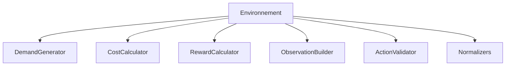

# Composants

Les composants sont des modules réutilisables qui implémentent des fonctionnalités spécifiques du système.

## 🧩 Vue d'Ensemble



## 📦 DemandGenerator

Génère la demande stochastique avec différentes intensités.

### Niveaux d'Intensité

| Niveau | Multiplicateur | Spikes | Description |
|--------|---------------|--------|-------------|
| `low` | 0.75 | 0.15 | Demande modérée |
| `medium` | 0.90 | 0.25 | Demande standard |
| `high` | 1.05 | 0.35 | Demande élevée |
| `extreme` | 1.20 | 0.45 | Stress test |

### Implémentation

```python
class DemandGenerator:
    def __init__(self, config):
        self.config = config
        self.intensity = config.demand_intensity
        self._setup_intensity_params()
        self.rng = np.random.default_rng()
    
    def _setup_intensity_params(self):
        params = {
            'low': {'multiplier': 0.75, 'spike_prob': 0.15},
            'medium': {'multiplier': 0.90, 'spike_prob': 0.25},
            'high': {'multiplier': 1.05, 'spike_prob': 0.35},
            'extreme': {'multiplier': 1.20, 'spike_prob': 0.45},
        }
        self.params = params[self.intensity]
    
    def generate(self, period: int) -> np.ndarray:
        """Génère la demande pour une période"""
        base_demand = self.config.demand_mean * self.params['multiplier']
        
        # Variation aléatoire
        noise = self.rng.normal(0, self.config.demand_std)
        
        # Composante saisonnière
        seasonal = 0.1 * np.sin(2 * np.pi * period / 12)
        
        # Spike aléatoire
        if self.rng.random() < self.params['spike_prob']:
            spike = self.rng.uniform(1.2, 1.5)
        else:
            spike = 1.0
        
        demand = (base_demand + noise) * (1 + seasonal) * spike
        return np.maximum(0, demand)
```

## 💰 CostCalculator

Calcule les différents coûts de production.

### Formules

$$C_{prod} = c_r \cdot P_r + c_h \cdot P_h + c_s \cdot P_s$$

$$C_{stock} = c_i \cdot \max(0, I)$$

$$C_{rupture} = c_b \cdot \max(0, -I)$$

### Implémentation

```python
class CostCalculator:
    def __init__(self, config):
        self.config = config
    
    def compute_production_cost(self, regular, overtime, subcontracting) -> float:
        """Calcule le coût de production"""
        cost = (
            self.config.regular_cost[0] * regular +
            self.config.overtime_cost[0] * overtime +
            self.config.subcontracting_cost[0] * subcontracting
        )
        return cost
    
    def compute_inventory_cost(self, stock_level: float) -> float:
        """Calcule le coût de stockage"""
        if stock_level > 0:
            return self.config.holding_cost[0] * stock_level
        return 0.0
    
    def compute_shortage_cost(self, shortage: float) -> float:
        """Calcule le coût de rupture"""
        return self.config.shortage_cost[0] * max(0, shortage)
    
    def compute_all_costs(self, production, stock, shortage) -> dict:
        """Calcule tous les coûts"""
        return {
            'production_cost': self.compute_production_cost(**production),
            'inventory_cost': self.compute_inventory_cost(stock),
            'shortage_cost': self.compute_shortage_cost(shortage),
        }
```

## 🎯 RewardCalculator

Calcule la récompense pour l'agent RL.

### Structure de Récompense

$$R = -\alpha_1 C_{total} + \alpha_2 \cdot SL + \alpha_3 \cdot Bonus$$

### Implémentation

```python
class RewardCalculator:
    def __init__(self, config):
        self.config = config
        # Poids normalisés
        self.weights = {
            'cost': 1.0,
            'service_level': 0.5,
            'safety_stock_bonus': 0.1,
        }
    
    def compute_reward(self, costs: dict, service_level: float, 
                       stock_level: float) -> float:
        """Calcule la récompense totale"""
        total_cost = sum(costs.values())
        
        # Normalisation des coûts
        cost_penalty = -total_cost / self.config.max_cost
        
        # Bonus service level
        service_bonus = service_level * self.weights['service_level']
        
        # Bonus stock de sécurité
        if stock_level >= self.config.safety_stock[0]:
            safety_bonus = self.weights['safety_stock_bonus']
        else:
            safety_bonus = 0
        
        reward = cost_penalty + service_bonus + safety_bonus
        return reward
```

## 👁️ ObservationBuilder

Construit les observations pour l'agent.

### Implémentation

```python
class ObservationBuilder:
    def __init__(self, config):
        self.config = config
    
    def build(self, env_state: dict) -> dict:
        """Construit l'observation à partir de l'état"""
        return {
            'stocks': np.array(env_state['stocks'], dtype=np.float32),
            'current_demand': np.array(env_state['demand'], dtype=np.float32),
            'current_period': np.array([env_state['period']], dtype=np.float32),
            'demand_forecast': np.array(env_state['forecast'], dtype=np.float32),
            'remaining_periods': np.array(
                [self.config.horizon - env_state['period']], 
                dtype=np.float32
            ),
        }
```

## ✅ ActionValidator

Valide et contraint les actions.

### Implémentation

```python
class ActionValidator:
    def __init__(self, config):
        self.config = config
    
    def validate(self, action: np.ndarray) -> np.ndarray:
        """Valide et contraint l'action"""
        # Clipper dans [0, 1]
        action = np.clip(action, 0, 1)
        
        # Convertir en quantités réelles
        regular = action[0] * self.config.regular_capacity[0]
        overtime = action[1] * self.config.overtime_capacity[0]
        subcontracting = action[2] * self.config.subcontracting_capacity[0]
        
        return np.array([regular, overtime, subcontracting])
```

## 📏 Normalizers

Normalise les données pour l'apprentissage.

### Implémentation

```python
class ObservationNormalizer:
    def __init__(self, config):
        self.config = config
        self.scales = {
            'stocks': config.max_stock[0],
            'demand': config.demand_mean[0] * 2,
            'period': config.horizon,
        }
    
    def normalize(self, obs: dict) -> dict:
        """Normalise une observation"""
        return {
            'stocks': obs['stocks'] / self.scales['stocks'],
            'current_demand': obs['current_demand'] / self.scales['demand'],
            'current_period': obs['current_period'] / self.scales['period'],
            # ...
        }
```

!!! note "VecNormalize"
    En pratique, nous utilisons `VecNormalize` de Stable-Baselines3 qui gère 
    automatiquement la normalisation des observations avec des statistiques 
    adaptatives.

## 🧪 Tests des Composants

```python
def test_demand_generator():
    config = get_example_config('rouleurs')
    gen = DemandGenerator(config)
    
    demands = [gen.generate(t) for t in range(12)]
    
    # Vérifier les bornes
    assert all(d >= 0 for d in demands)
    assert np.mean(demands) > 0

def test_cost_calculator():
    config = get_example_config('rouleurs')
    calc = CostCalculator(config)
    
    costs = calc.compute_all_costs(
        production={'regular': 80, 'overtime': 10, 'subcontracting': 5},
        stock=50,
        shortage=0
    )
    
    assert 'production_cost' in costs
    assert costs['shortage_cost'] == 0
```

## Prochaine Étape

➡️ [Agents](agents.md)
