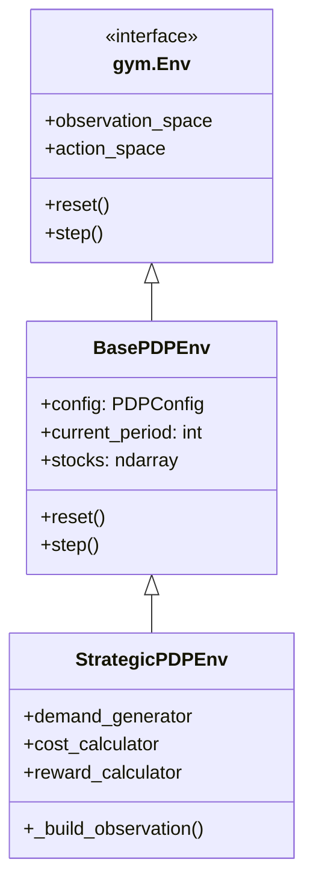

# Environnements

Les environnements définissent le problème de planification comme un MDP (Markov Decision Process) compatible avec Gymnasium.

## 🏗️ Hiérarchie



## 📦 BasePDPEnv

Environnement de base avec fonctionnalités minimales.

### Espace d'Observation

```python
observation_space = Dict({
    'stocks': Box(0, max_stock, shape=(n_products,)),
    'demand': Box(0, max_demand, shape=(n_products,)),
    'period': Box(0, horizon, shape=(1,))
})
```

### Espace d'Action

```python
# Actions continues normalisées [0, 1]
action_space = Box(
    low=0.0,
    high=1.0,
    shape=(3,),  # [regular, overtime, subcontracting]
    dtype=np.float32
)
```

### Méthodes Principales

```python
def reset(self, seed=None):
    """Réinitialise l'environnement"""
    self.current_period = 0
    self.stocks = self.config.initial_stock.copy()
    self.demand = self._generate_demand()
    return self._build_observation(), {}

def step(self, action):
    """Exécute une action"""
    # 1. Valider l'action
    validated_action = self._validate_action(action)
    
    # 2. Calculer la production
    production = self._compute_production(validated_action)
    
    # 3. Mettre à jour les stocks
    self._update_stocks(production)
    
    # 4. Calculer les coûts
    costs = self._compute_costs(production)
    
    # 5. Calculer la récompense
    reward = self._compute_reward(costs)
    
    # 6. Avancer la période
    self.current_period += 1
    done = self.current_period >= self.config.horizon
    
    return self._build_observation(), reward, done, False, info
```

## 🎯 StrategicPDPEnv

Environnement enrichi avec observations étendues et composants modulaires.

### Observations Enrichies

```python
observation_space = Dict({
    # État actuel
    'stocks': Box(...),
    'current_demand': Box(...),
    'current_period': Box(...),
    
    # Informations contextuelles
    'demand_forecast': Box(...),      # Prévisions futures
    'capacity_utilization': Box(...), # Utilisation capacité
    'remaining_periods': Box(...),    # Périodes restantes
    
    # Historique (optionnel)
    'demand_history': Box(...),
    'production_history': Box(...)
})
```

### Composants Injectés

```python
class StrategicPDPEnv(BasePDPEnv):
    def __init__(self, config):
        super().__init__(config)
        
        # Injection des composants
        self.demand_generator = DemandGenerator(config)
        self.cost_calculator = CostCalculator(config)
        self.reward_calculator = RewardCalculator(config)
        self.observation_builder = ObservationBuilder(config)
        self.action_validator = ActionValidator(config)
```

## 🏭 EnvironmentRegistry

Factory pattern pour créer les environnements :

```python
class EnvironmentRegistry:
    _registry = {
        'base': BasePDPEnv,
        'strategic': StrategicPDPEnv,
    }
    
    @classmethod
    def create(cls, env_type: str, config: PDPConfig) -> gym.Env:
        """Crée un environnement du type spécifié"""
        if env_type not in cls._registry:
            raise ValueError(f"Unknown env type: {env_type}")
        return cls._registry[env_type](config)
    
    @classmethod
    def register(cls, name: str, env_class):
        """Enregistre un nouveau type d'environnement"""
        cls._registry[name] = env_class
```

### Utilisation

```python
from environments import EnvironmentRegistry
from config import get_example_config

config = get_example_config('rouleurs')
env = EnvironmentRegistry.create('strategic', config)

# Avec Stable-Baselines3
from stable_baselines3.common.vec_env import DummyVecEnv, VecNormalize

vec_env = DummyVecEnv([lambda: EnvironmentRegistry.create('strategic', config)])
vec_env = VecNormalize(vec_env, norm_obs=True, norm_reward=False)
```

## ⚙️ Configuration

Les environnements sont configurés via `PDPConfig` :

```python
@dataclass
class PDPConfig:
    # Dimensions
    n_products: int = 1
    horizon: int = 12
    
    # Capacités
    regular_capacity: list = field(default_factory=lambda: [100])
    overtime_capacity: list = field(default_factory=lambda: [30])
    subcontracting_capacity: list = field(default_factory=lambda: [50])
    
    # Coûts
    regular_cost: list = field(default_factory=lambda: [10])
    overtime_cost: list = field(default_factory=lambda: [15])
    subcontracting_cost: list = field(default_factory=lambda: [20])
    holding_cost: list = field(default_factory=lambda: [2])
    shortage_cost: list = field(default_factory=lambda: [50])
    
    # Stocks
    initial_stock: list = field(default_factory=lambda: [50])
    max_stock: list = field(default_factory=lambda: [500])
    safety_stock: list = field(default_factory=lambda: [20])
    
    # Demande
    demand_mean: list = field(default_factory=lambda: [80])
    demand_std: list = field(default_factory=lambda: [15])
    demand_intensity: str = 'medium'
```

## 📊 Informations Retournées

Le dictionnaire `info` retourné par `step()` contient :

```python
info = {
    # Métriques de production
    'total_production': float,
    'regular_production': float,
    'overtime_production': float,
    'subcontracting_production': float,
    
    # État
    'inventory_level': ndarray,
    'demand_fulfillment': float,  # Service level
    
    # Coûts
    'costs': {
        'production_cost': float,
        'inventory_cost': float,
        'shortage_cost': float,
    },
    
    # Données brutes
    'raw_metrics': {
        'current_demand': ndarray,
        'stock_before_prod': ndarray,
        'stock_after_prod': ndarray,
        'demand_satisfied': ndarray,
        'shortage': ndarray,
    }
}
```

## 🧪 Tests

```python
def test_environment():
    config = get_example_config('rouleurs')
    env = EnvironmentRegistry.create('strategic', config)
    
    # Test reset
    obs, info = env.reset()
    assert 'stocks' in obs
    
    # Test step
    action = env.action_space.sample()
    obs, reward, done, truncated, info = env.step(action)
    
    assert isinstance(reward, float)
    assert 'costs' in info
    
    # Test épisode complet
    env.reset()
    for _ in range(config.horizon):
        action = env.action_space.sample()
        obs, reward, done, truncated, info = env.step(action)
    
    assert done
```

## Prochaine Étape

➡️ [Composants](components.md)
