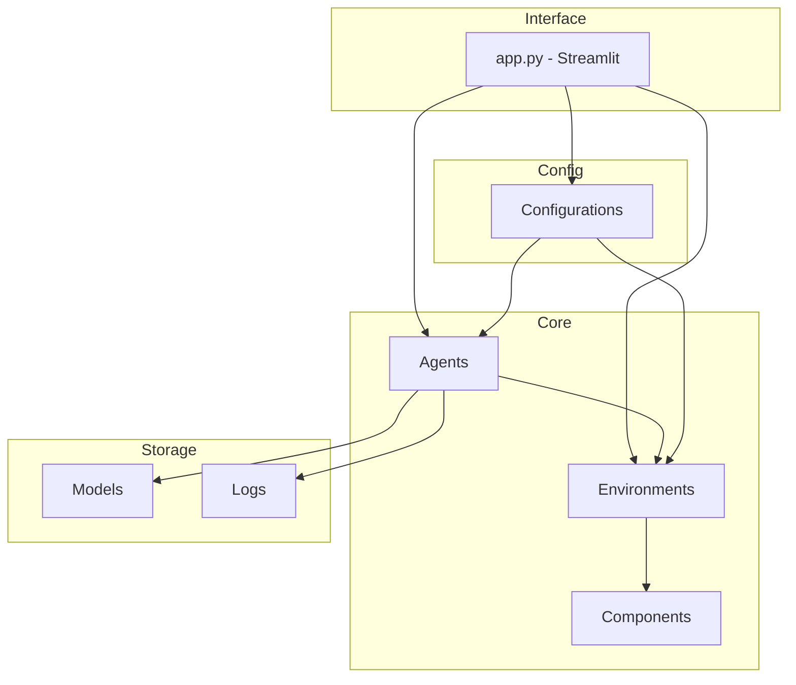
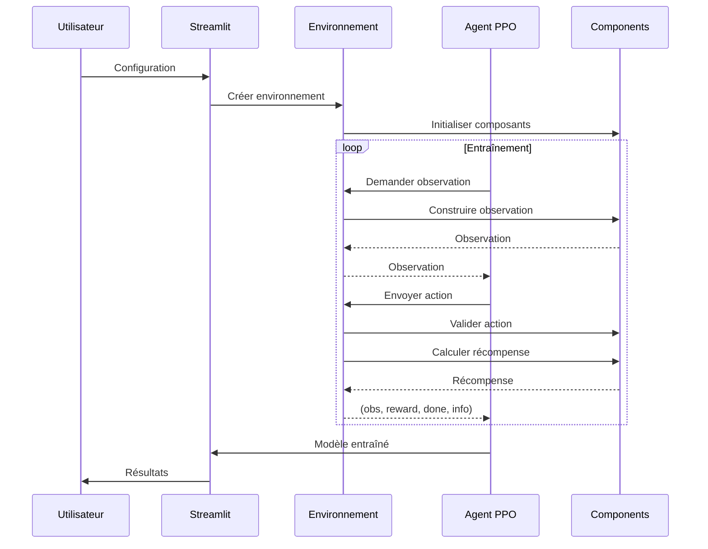

# Vue d'ensemble de l'Architecture

## 📁 Structure du Projet

```
RLPlanif/
├── 📄 app.py                    # Interface Streamlit principale
├── 📄 requirements.txt          # Dépendances Python
├── 📄 mkdocs.yml               # Configuration documentation
│
├── 🎮 environments/            # Environnements Gymnasium
│   ├── __init__.py
│   ├── base_pdp_env.py         # Environnement de base
│   ├── strategic_pdp_env.py    # Env avec observations enrichies
│   └── env_registry.py         # Factory pattern
│
├── 🤖 agents/                  # Agents et stratégies
│   ├── __init__.py
│   ├── ppo_trainer.py          # Entraîneur PPO
│   ├── baseline_strategies.py  # Stratégies classiques
│   └── rl_utils.py             # Utilitaires RL
│
├── 🧩 components/              # Composants modulaires
│   ├── __init__.py
│   ├── demand_generators.py    # Génération de demande
│   ├── cost_calculators.py     # Calcul des coûts
│   ├── reward_calculators.py   # Fonctions de récompense
│   ├── observation_builders.py # Construction observations
│   ├── action_validators.py    # Validation actions
│   ├── constraints.py          # Contraintes production
│   └── normalizers.py          # Normalisation données
│
├── ⚙️ config/                  # Configuration
│   ├── __init__.py
│   ├── base_config.py          # Classe de base
│   ├── environment_configs.py  # Configs environnement
│   ├── training_configs.py     # Configs entraînement
│   └── real_examples_configs.py # Exemples industriels
│
├── 📜 scripts/                 # Scripts CLI
│   ├── train.py                # Entraînement
│   ├── evaluate.py             # Évaluation
│   ├── compare_strategies.py   # Comparaison
│   └── test_env.py             # Tests environnement
│
├── 🧪 tests/                   # Tests unitaires
│   └── test_components.py
│
├── 📊 models/                  # Modèles sauvegardés
│   └── training_*/             # Dossiers par entraînement
│
├── 📈 logs/                    # Logs
│   └── tensorboard/            # Logs TensorBoard
│
└── 📚 docs/                    # Documentation
    └── *.md                    # Fichiers Markdown
```

## 🏗️ Architecture Logicielle



## 🎮 Flux de Données



## 📦 Modules Principaux

### 1. Environments

Implémentent l'interface `gymnasium.Env` :

```python
class BasePDPEnv(gym.Env):
    observation_space: Dict
    action_space: Box
    
    def reset() -> observation
    def step(action) -> (obs, reward, done, info)
```

### 2. Agents

Gèrent l'entraînement et l'inférence :

```python
class PPOTrainer:
    def train(timesteps) -> model
    def evaluate(n_episodes) -> results
    def save(path)
    def load(path)
```

### 3. Components

Composants modulaires et réutilisables :

| Composant | Responsabilité |
|-----------|----------------|
| `DemandGenerator` | Génère la demande stochastique |
| `CostCalculator` | Calcule les coûts de production |
| `RewardCalculator` | Calcule la récompense RL |
| `ObservationBuilder` | Construit les observations |
| `ActionValidator` | Valide et contraint les actions |

### 4. Config

Configurations dataclass :

```python
@dataclass
class PDPConfig:
    n_products: int
    horizon: int
    regular_capacity: list
    # ...
```

## 🔌 Design Patterns

### Factory Pattern (Environnements)

```python
class EnvironmentRegistry:
    @staticmethod
    def create(env_type: str, config) -> gym.Env:
        if env_type == 'strategic':
            return StrategicPDPEnv(config)
        elif env_type == 'base':
            return BasePDPEnv(config)
```

### Strategy Pattern (Baselines)

```python
class BaseStrategy(ABC):
    @abstractmethod
    def get_action(self, observation) -> action

class LotForLotStrategy(BaseStrategy):
    def get_action(self, observation):
        # Implémentation L4L
```

### Composition (Components)

```python
class StrategicPDPEnv:
    def __init__(self, config):
        self.demand_gen = DemandGenerator(config)
        self.cost_calc = CostCalculator(config)
        self.reward_calc = RewardCalculator(config)
```

## 🔄 Cycle de Vie

### Entraînement

1. **Configuration** → Charger/créer config
2. **Environnement** → Instancier via Registry
3. **Vectorisation** → DummyVecEnv + VecNormalize
4. **Modèle** → Créer PPO avec hyperparamètres
5. **Callbacks** → EarlyStopping, Checkpoints
6. **Training** → model.learn(timesteps)
7. **Sauvegarde** → Modèle + VecNormalize

### Évaluation

1. **Chargement** → Modèle + VecNormalize
2. **Environnement** → Mode évaluation
3. **Rollouts** → N épisodes
4. **Métriques** → Agrégation
5. **Comparaison** → Vs baselines

## Prochaine Étape

➡️ [Détail des Environnements](environments.md)
