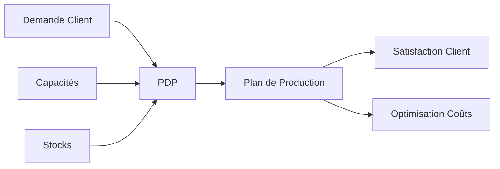

# Plan Directeur de Production (PDP)

## 📖 Définition

Le **Plan Directeur de Production** (PDP), ou *Master Production Schedule* (MPS) en anglais, est un outil fondamental de la planification industrielle. Il définit **quoi produire**, **en quelle quantité** et **quand**, sur un horizon de planification donné.

## 🎯 Objectifs du PDP

Le PDP vise à équilibrer plusieurs objectifs :

| Objectif | Description |
|----------|-------------|
| **Satisfaction demande** | Répondre aux commandes clients |
| **Minimisation coûts** | Réduire les coûts totaux de production |
| **Gestion des stocks** | Éviter surstock et ruptures |
| **Utilisation capacité** | Optimiser l'usage des ressources |

## 📊 Structure d'un PDP

Un tableau PDP typique contient :

| Période | P1 | P2 | P3 | P4 | P5 | P6 |
|---------|----|----|----|----|----|----|
| **Stock Initial** | 50 | 70 | 45 | 55 | 40 | 60 |
| **Demande** | 80 | 95 | 90 | 85 | 100 | 75 |
| **Production** | 100 | 70 | 100 | 70 | 120 | 80 |
| **Stock Final** | 70 | 45 | 55 | 40 | 60 | 65 |

## 💰 Composantes des Coûts

### Coûts de Production

$$C_{prod} = \sum_{t=1}^{T} (c_r \cdot P_r^t + c_h \cdot P_h^t + c_s \cdot P_s^t)$$

Où :

- $c_r$ : Coût production régulière
- $c_h$ : Coût heures supplémentaires
- $c_s$ : Coût sous-traitance
- $P_r^t, P_h^t, P_s^t$ : Quantités produites à la période $t$

### Coûts de Stockage

$$C_{stock} = \sum_{t=1}^{T} c_i \cdot I^t$$

Où $c_i$ est le coût de stockage unitaire et $I^t$ le niveau de stock.

### Coûts de Rupture

$$C_{rupture} = \sum_{t=1}^{T} c_b \cdot B^t$$

Où $c_b$ est le coût de rupture unitaire et $B^t$ la quantité en rupture.

### Coût Total

$$C_{total} = C_{prod} + C_{stock} + C_{rupture}$$

## 🔧 Contraintes

### Contraintes de Capacité

$$P_r^t \leq Cap_r, \quad P_h^t \leq Cap_h, \quad P_s^t \leq Cap_s$$

### Conservation des Stocks

$$I^t = I^{t-1} + P^t - D^t$$

Où $D^t$ est la demande à la période $t$.

### Non-négativité

$$P^t \geq 0, \quad I^t \geq 0$$

## 📈 Stratégies Classiques

### 1. Lot-for-Lot (L4L)

Production exactement égale à la demande nette.

$$P^t = \max(0, D^t - I^{t-1})$$

**Avantages** : Pas de surstock
**Inconvénients** : Variations de production élevées

### 2. Chase Strategy

Ajuster la production pour suivre la demande.

**Avantages** : Stocks faibles
**Inconvénients** : Coûts de changement

### 3. Level Strategy

Production constante sur l'horizon.

$$P^t = \frac{\sum_{t=1}^{T} D^t}{T}$$

**Avantages** : Stabilité
**Inconvénients** : Stocks élevés

### 4. EOQ (Economic Order Quantity)

Quantité économique optimale.

$$EOQ = \sqrt{\frac{2 \cdot D \cdot S}{H}}$$

Où $S$ est le coût de setup et $H$ le coût de stockage annuel.

## 🤖 Pourquoi le RL ?

Les méthodes classiques ont des limitations :

| Limitation | Impact |
|------------|--------|
| Règles fixes | Pas d'adaptation au contexte |
| Myopie | Décisions sans vision long terme |
| Simplicité | Ne gèrent pas la complexité |

L'apprentissage par renforcement permet :

- ✅ **Adaptation** : Apprend du contexte
- ✅ **Vision long terme** : Optimise sur l'horizon
- ✅ **Complexité** : Gère multi-produits, multi-contraintes

## Prochaine Étape

➡️ [Apprentissage par Renforcement](reinforcement-learning.md)
