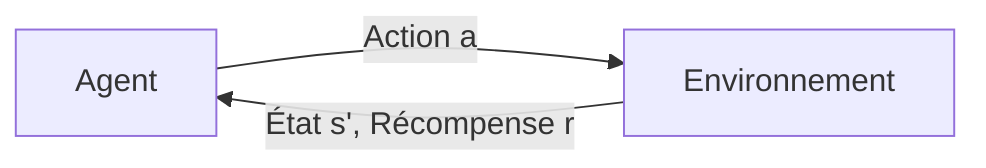

# Apprentissage par Renforcement

## 📖 Introduction

L'**Apprentissage par Renforcement** (Reinforcement Learning, RL) est un paradigme d'apprentissage automatique où un **agent** apprend à prendre des décisions en interagissant avec un **environnement**.



## 🎯 Concepts Fondamentaux

### Agent et Environnement

| Concept | Description | Dans RLPlanif |
|---------|-------------|---------------|
| **Agent** | Prend les décisions | Algorithme PPO |
| **Environnement** | Système à contrôler | Usine de production |
| **État** | Observation du système | Stocks, demande, période |
| **Action** | Décision de l'agent | Quantités à produire |
| **Récompense** | Feedback sur l'action | Coûts et service |

### Processus de Décision Markovien (MDP)

Un MDP est défini par le tuple $(S, A, P, R, \gamma)$ :

- $S$ : Espace des états
- $A$ : Espace des actions
- $P(s'|s,a)$ : Probabilités de transition
- $R(s,a,s')$ : Fonction de récompense
- $\gamma$ : Facteur de discount

### Politique

Une **politique** $\pi$ définit le comportement de l'agent :

$$\pi(a|s) = P(A_t = a | S_t = s)$$

L'objectif est de trouver la politique optimale $\pi^*$ qui maximise le retour cumulé :

$$\pi^* = \arg\max_\pi \mathbb{E}\left[\sum_{t=0}^{T} \gamma^t R_t\right]$$

## 📊 Formulation pour le PDP

### Espace d'États

Dans RLPlanif, l'état contient :

```python
observation = {
    'stocks': [...],           # Niveaux de stock par produit
    'demand_forecast': [...],  # Prévisions de demande
    'current_period': ...,     # Période actuelle
    'capacities': [...]        # Capacités disponibles
}
```

### Espace d'Actions

L'action est un vecteur continu $a \in [0,1]^3$ :

$$a = [a_{regular}, a_{overtime}, a_{subcontracting}]$$

Chaque composante représente le pourcentage de capacité à utiliser.

### Fonction de Récompense

La récompense combine plusieurs objectifs :

$$R = -\alpha_1 \cdot C_{prod} - \alpha_2 \cdot C_{stock} - \alpha_3 \cdot C_{rupture} + \alpha_4 \cdot ServiceLevel$$

## 🧠 Algorithmes

### Value-Based Methods

Apprennent la **fonction de valeur** $V(s)$ ou $Q(s,a)$ :

- **Q-Learning** : Off-policy, tabulaire
- **DQN** : Deep Q-Network, utilise des réseaux de neurones
- **SARSA** : On-policy

### Policy Gradient Methods

Optimisent directement la **politique** $\pi_\theta$ :

$$\nabla_\theta J(\theta) = \mathbb{E}\left[\nabla_\theta \log \pi_\theta(a|s) \cdot A(s,a)\right]$$

- **REINFORCE** : Monte Carlo policy gradient
- **A2C** : Advantage Actor-Critic
- **PPO** : Proximal Policy Optimization ⭐

### Actor-Critic Methods

Combinent les deux approches :

- **Actor** : Politique $\pi_\theta(a|s)$
- **Critic** : Fonction de valeur $V_\phi(s)$

## 📈 Avantages du RL pour le PDP

| Avantage | Description |
|----------|-------------|
| **Adaptabilité** | S'adapte aux changements de demande |
| **Optimisation globale** | Vision sur tout l'horizon |
| **Gestion d'incertitude** | Apprend des patterns stochastiques |
| **Multi-objectif** | Balance coûts et service |

## ⚖️ Défis

| Défi | Solution dans RLPlanif |
|------|------------------------|
| **Sample efficiency** | PPO avec rollouts efficaces |
| **Stabilité** | VecNormalize, gradient clipping |
| **Exploration** | Entropie dans la politique |
| **Convergence** | EarlyStopping callback |

## 🔬 Évaluation

### Métriques RL

- **Return moyen** : $\bar{G} = \frac{1}{N}\sum_{i=1}^{N} G_i$
- **Écart-type** : Stabilité des performances
- **Courbe d'apprentissage** : Progression dans le temps

### Métriques Métier

- **Coût total** : Objectif principal
- **Service level** : Satisfaction demande
- **Utilisation capacité** : Efficacité production

## Prochaine Étape

➡️ [Algorithme PPO](ppo.md)
