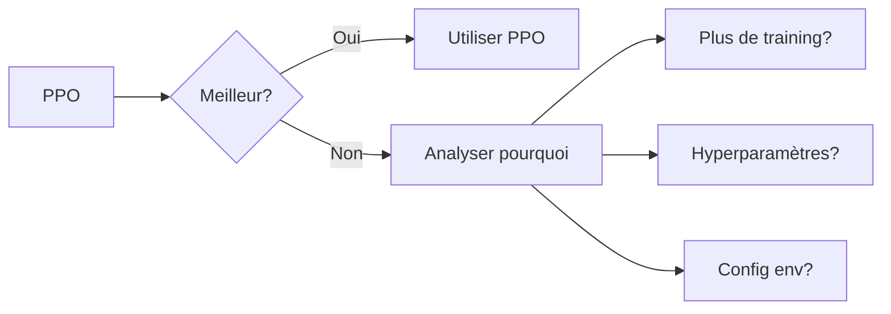

# Stratégies Baseline

Les stratégies baseline servent de référence pour évaluer les performances de l'agent PPO.

## 📊 Vue d'Ensemble

| Stratégie | Description | Cas d'usage idéal |
|-----------|-------------|-------------------|
| **Lot-for-Lot** | Production = Demande nette | Demande stable |
| **Chase** | Suivre la demande | Capacité flexible |
| **Level** | Production constante | Coûts de changement élevés |
| **EOQ** | Quantité économique | Coûts de setup importants |

## 🎯 Lot-for-Lot (L4L)

### Principe

Produire exactement la demande nette à chaque période.

$$P^t = \max(0, D^t - I^{t-1})$$

### Avantages

- ✅ Pas de surstock
- ✅ Simple à implémenter
- ✅ Bon pour demande prévisible

### Inconvénients

- ❌ Variations de production élevées
- ❌ Peut nécessiter beaucoup d'HS
- ❌ Pas d'anticipation

### Implémentation

```python
class LotForLotStrategy(BaseStrategy):
    def get_action(self, observation: dict) -> np.ndarray:
        demand = observation['current_demand'][0]
        stock = observation['stocks'][0]
        
        # Demande nette
        net_demand = max(0, demand - stock)
        
        # Allouer aux capacités
        regular = min(net_demand, self.config.regular_capacity[0])
        remaining = net_demand - regular
        
        overtime = min(remaining, self.config.overtime_capacity[0])
        remaining -= overtime
        
        subcontracting = min(remaining, self.config.subcontracting_capacity[0])
        
        # Normaliser
        return np.array([
            regular / self.config.regular_capacity[0],
            overtime / self.config.overtime_capacity[0] if self.config.overtime_capacity[0] > 0 else 0,
            subcontracting / self.config.subcontracting_capacity[0]
        ])
```

## 🔄 Chase Strategy

### Principe

Ajuster la production pour "suivre" la demande en utilisant proportionnellement toutes les capacités.

### Avantages

- ✅ Stocks faibles
- ✅ Réactif aux changements
- ✅ Utilise toutes les capacités

### Inconvénients

- ❌ Coûts HS/sous-traitance élevés
- ❌ Instabilité de production

### Implémentation

```python
class ChaseStrategy(BaseStrategy):
    def get_action(self, observation: dict) -> np.ndarray:
        demand = observation['current_demand'][0]
        
        # Capacité totale disponible
        total_cap = (
            self.config.regular_capacity[0] +
            self.config.overtime_capacity[0] +
            self.config.subcontracting_capacity[0]
        )
        
        # Ratio de demande
        ratio = min(1.0, demand / total_cap) if total_cap > 0 else 0
        
        return np.array([ratio, ratio, ratio])
```

## 📏 Level Strategy

### Principe

Produire une quantité constante sur tout l'horizon pour lisser la production.

$$P^t = \frac{\sum_{t=1}^{T} D^t}{T}$$

### Avantages

- ✅ Production stable
- ✅ Planification facile
- ✅ Pas de variations de main d'œuvre

### Inconvénients

- ❌ Stocks élevés en période basse
- ❌ Ruptures en période haute
- ❌ Pas d'adaptation

### Implémentation

```python
class LevelStrategy(BaseStrategy):
    def __init__(self, env):
        super().__init__(env)
        # Calculer le niveau de production constant
        avg_demand = np.mean(self.config.demand_mean)
        self.level_production = avg_demand
    
    def get_action(self, observation: dict) -> np.ndarray:
        regular_cap = self.config.regular_capacity[0]
        
        # Produire au niveau constant
        production = min(self.level_production, regular_cap)
        ratio = production / regular_cap
        
        return np.array([ratio, 0.0, 0.0])
```

## 💰 EOQ Strategy

### Principe

Produire selon la formule de quantité économique de commande.

$$EOQ = \sqrt{\frac{2DS}{H}}$$

Où :

- $D$ = Demande annuelle
- $S$ = Coût de setup
- $H$ = Coût de stockage annuel

### Avantages

- ✅ Optimal pour coûts de setup
- ✅ Théoriquement fondé
- ✅ Minimise coût total

### Inconvénients

- ❌ Assume demande constante
- ❌ Ignore les capacités
- ❌ Pas adapté à la variabilité

### Implémentation

```python
class EOQStrategy(BaseStrategy):
    def __init__(self, env):
        super().__init__(env)
        
        # Paramètres EOQ
        D = self.config.demand_mean[0] * self.config.horizon
        S = getattr(self.config, 'setup_cost', 100)
        H = self.config.holding_cost[0]
        
        self.eoq = np.sqrt(2 * D * S / H) if H > 0 else D / 4
        self.reorder_point = self.eoq / 2
    
    def get_action(self, observation: dict) -> np.ndarray:
        stock = observation['stocks'][0]
        
        if stock < self.reorder_point:
            # Commander EOQ
            production = min(self.eoq, self.config.regular_capacity[0])
            ratio = production / self.config.regular_capacity[0]
            return np.array([ratio, 0.0, 0.0])
        
        return np.array([0.0, 0.0, 0.0])
```

## 📈 Comparaison Typique

### Résultats sur Exemple "Rouleurs"

| Stratégie | Coût Total | Service Level | Avantage PPO |
|-----------|------------|---------------|--------------|
| **PPO** | **2,450** | **98.5%** | Référence |
| Lot-for-Lot | 3,200 | 95.2% | +30% |
| Chase | 2,890 | 96.8% | +18% |
| Level | 3,500 | 92.1% | +43% |
| EOQ | 2,750 | 97.3% | +12% |

### Interprétation



## 🔧 Personnalisation

### Créer une Stratégie Custom

```python
class MyCustomStrategy(BaseStrategy):
    """Stratégie personnalisée"""
    
    def __init__(self, env):
        super().__init__(env)
        # Initialisation custom
        self.my_param = 0.8
    
    def get_action(self, observation: dict) -> np.ndarray:
        demand = observation['current_demand'][0]
        stock = observation['stocks'][0]
        period = observation['current_period'][0]
        
        # Logique personnalisée
        if period < self.config.horizon / 2:
            # Première moitié : production agressive
            target = demand * 1.1
        else:
            # Seconde moitié : réduction des stocks
            target = demand * 0.9
        
        production = max(0, target - stock)
        regular = min(production, self.config.regular_capacity[0])
        
        return np.array([
            regular / self.config.regular_capacity[0],
            0.0,
            0.0
        ])
```

### Enregistrer une Nouvelle Stratégie

```python
from agents.baseline_strategies import BASELINE_STRATEGIES

BASELINE_STRATEGIES['my_custom'] = MyCustomStrategy
```

## Prochaine Étape

➡️ [Cas Industriels](../examples/industrial-cases.md)
